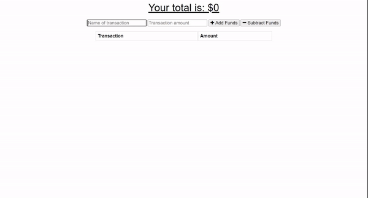

# Budget Tracker
Are you thinking about traveling but you don't know how to keep track of your budget? Not willing to write it down on paper and track it manually? Well look no further! With the Budget Tracker Application, you can put down what your starting budget is, then put down the expenses and what the cost is. You can download this application on your mobile phone and take it offline. You can still input the expanses, or any income that may come while you are traveling, while offline. Once you get back online, just hit refresh, and the app will sync the data together!

### Check this out to see some details!

